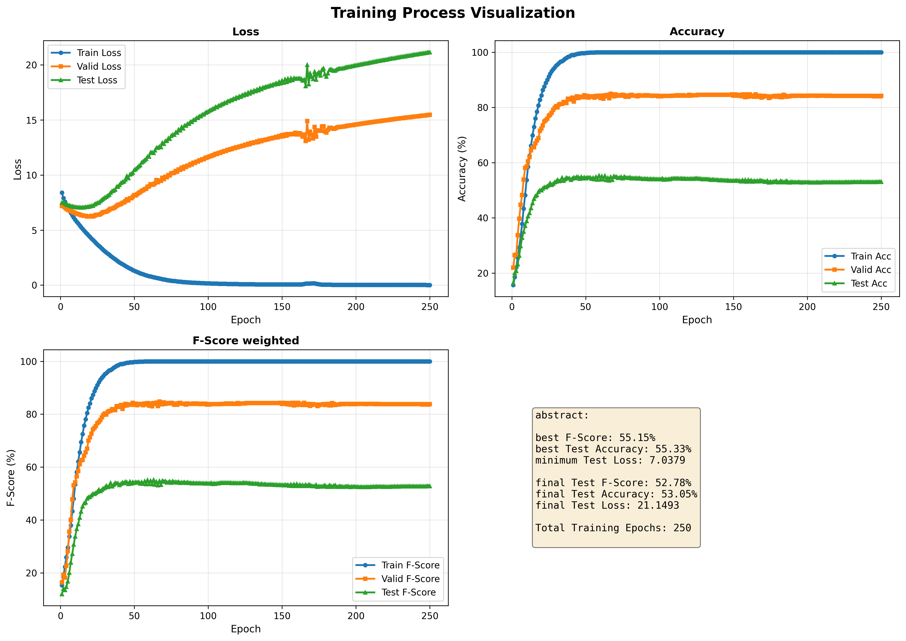
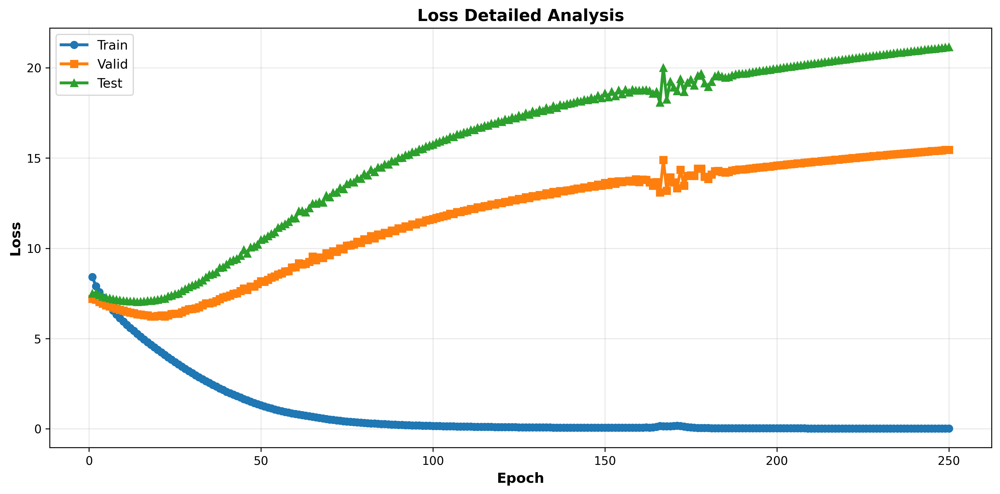
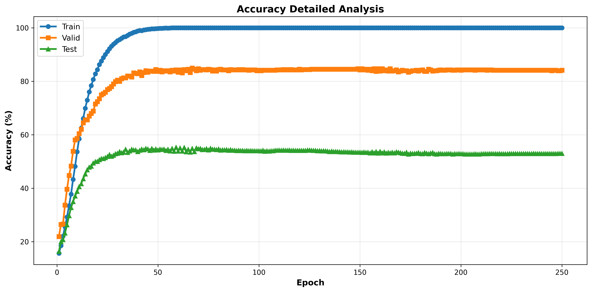
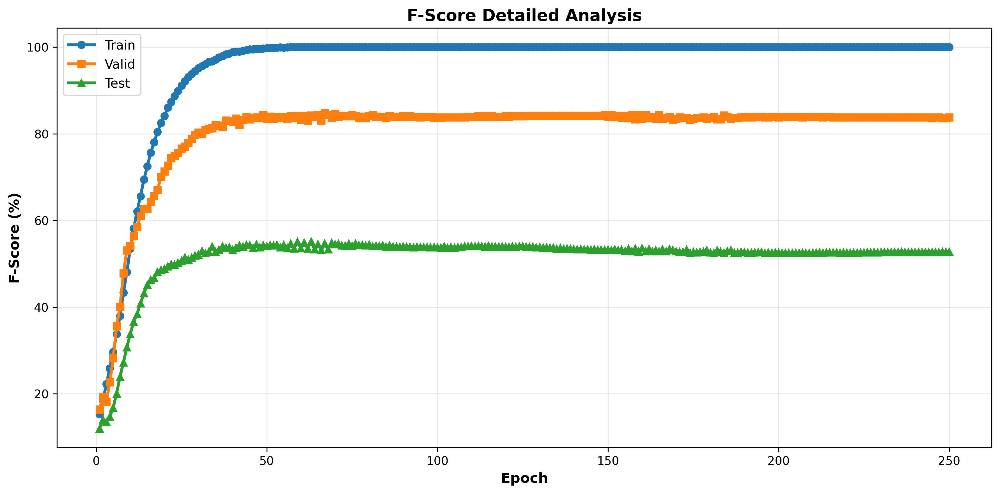

# 模型训练分析报告

## 模型信息
- **模型名称**: concat_avl_relation_fullusing_lstm_IEMOCAP_speaker_modal
- **训练日期**: 2026-05-05
- **总训练轮数**: 250

## 性能统计

### 最佳性能指标
- **最佳测试F-Score**: 55.15%
- **最佳测试准确率**: 55.33%
- **最低测试损失**: 7.0379

### 最终性能指标
- **最终测试F-Score**: 52.78%
- **最终测试准确率**: 53.05%
- **最终测试损失**: 21.1493

## 训练过程分析

### 损失曲线趋势
- 训练损失: 从 8.4086 到 0.0190
- 验证损失: 从 7.2070 到 15.4615
- 测试损失: 从 7.4999 到 21.1493

### 准确率曲线趋势
- 训练准确率: 从 15.69% 到 100.00%
- 验证准确率: 从 21.95% 到 84.14%
- 测试准确率: 从 16.39% 到 53.05%

### F-Score曲线趋势
- 训练F-Score: 从 15.27% 到 100.00%
- 验证F-Score: 从 16.41% 到 83.77%
- 测试F-Score: 从 11.98% 到 52.78%

## 可视化图表
- 
- 
- 
- 

## 结论
该模型在训练过程中显示出[在此处添加具体分析]的性能表现。建议进一步的超参数调优或数据增强以提升性能。

---
*此报告由自动分析脚本生成*
